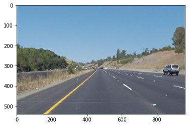
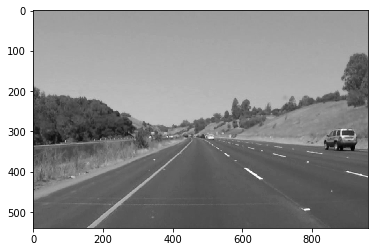
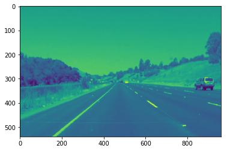
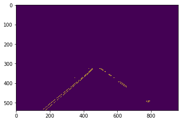
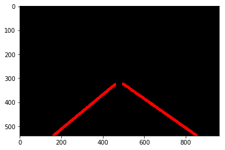
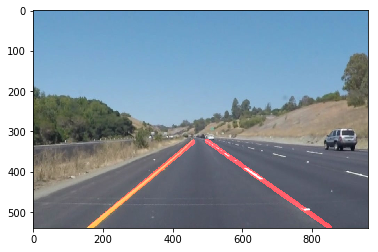

# **Finding Lane Lines on the Road** 

### This project is about using various methods in image detection to filter an image from, what would be, a car-mounted camera taking pictures or video of the road ahead while driving in order to determine and annotate the lines for the current lane.

---

**Finding Lane Lines on the Road**

The goals / steps of this project are the following:
* Make a pipeline that finds lane lines on the road and marks up the image to show where the lines exist
* Apply the pipeline used for the single images to each frame in a video
* Improve the methodology for drawing the lane lines to come up with a average of all lines found for a lane and extend the line(s) to the bottom of the image where no line is visible due to a dashed lane line
* Try to improve the detection and markup of lane lines in an instance where the lines are not straight
* Reflect on your work in a written report

[//]: # (Image References)

---

### Reflection

The pipeline used for lane detection and annotation consists of 6 steps as follows:

1. Convert the original image to grayscale
2. Apply a gaussian blur to the grayscale image
3. Apply canny edge detection to find the edges of objects in the image
4. Define a region of interest and filter out all other edges
5. Using a blank image, create lines for the edges that are left
6. Transfer the drawn lines to the original image

In order to draw a signle line on the left and right lanes, I modified the draw_lines() function by first seperating the edges based on their slope to determine left/right lanes. I then used the fitLine function in OpenCV to come up with an average of all the separate edges in each set (left/right) and calculated the new slope/intercept to extend any line that did not completely reach the bottom of the image to determine the x-coordinate for the maximum y-coordinate of the image. This allowed me to draw a complete line from the top-most point in the set of edges to the bottom of the image that better fit the lane line.

### Shortcomings

Unfortunately, there are many shortcomings invovled with this method. Although it works for a straight road with normal grade, it does not work for curved roads and I do not believe it will work well for roads with a steep incline or decline as that will affect where the horizon exists along the y-axis which would either add too many artifacts or limit the amount of lane that is detected.

### Possible Improvements

One possible improvement would be to determine where the horizon exists in the image in order to calculate how much of the y-axis to include in the region of interest.

Another possible improvement would be to find a polynomial fitting function, like fitPoly in numpy, a method to extend those curves to the bottom of the image, and a way to draw those curves on the image.

A thrid possible solution would be to determine if the front end of the vehicle is in the image/videos in order to filter out that part of the image from the region of interest. I did not notice this until the Challenge part of the assignment as the other images/video did not include that. This brings up other concerns of what other types of artifacts might need to be filtered out, for example, anyone or anything in the middle of the road (person, cat, dog, road construction cone, etc.).
